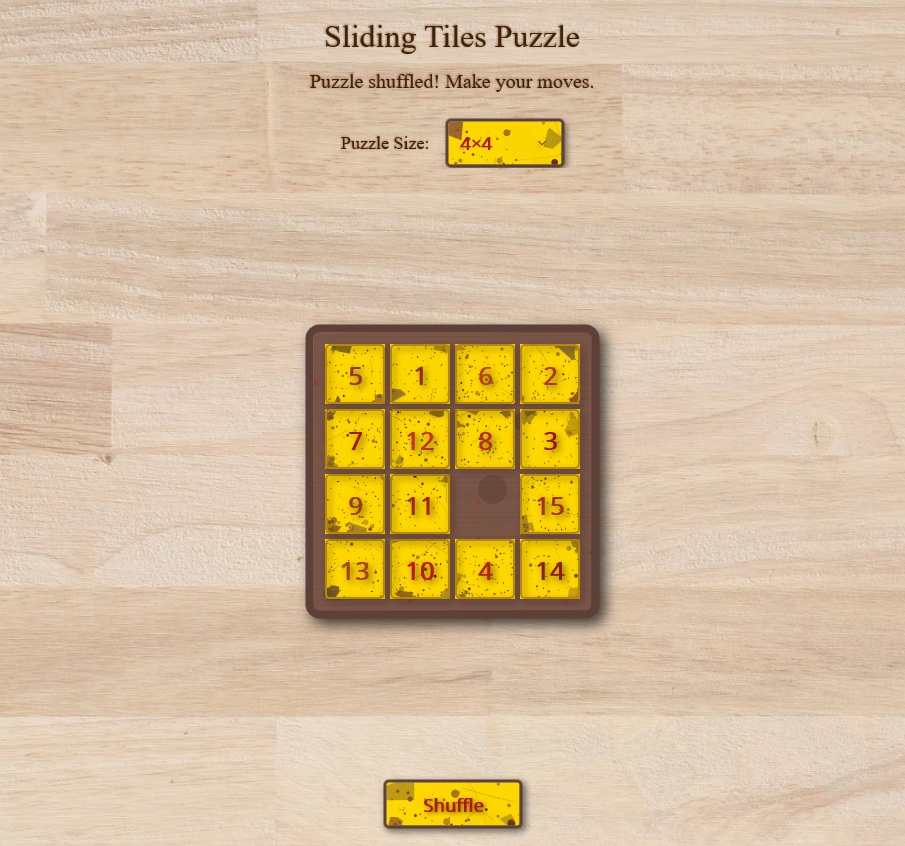

# Sliding Tiles Puzzle



## About This Project

This Sliding Tiles Puzzle is a classic number-ordering puzzle game with a unique antique aesthetic. Players arrange scrambled numbered tiles in sequential order by sliding them into an empty space.

### A GitHub Copilot Experiment

**100% of the code in this project was created using GitHub Copilot.** This includes:

- All application logic and game mechanics
- The custom texturing and visual effects
- UI design and animations
- Cross-platform compatibility
- This README file

The only element not generated by Copilot was the tabletop background image. Everything else was created through "vibe coding" - describing the desired outcome to Copilot and iteratively refining the implementation through prompts.

## Features

### Visual Design

- **Antique Aesthetic**: Rich wooden textures with aged appearance
- **Gold Leaf Texturing**: Procedurally generated gold leaf texture on tiles and buttons
- **Burned-in Text**: Labels with serif typography and shadow effects that appear burned into the wood
- **Dynamic Lighting Effects**: Subtle procedural lighting variations across the board

### Technical Highlights

- **Custom Rendering**: Procedural texture generation using SkiaSharp
- **Custom Controls**: Textured tiles and picker with realistic effects
- **Fluid Animations**: Smooth sliding animations with acceleration/deceleration
- **Responsive Layout**: Adapts to different screen sizes and orientations
- **Cross-Platform**: Works on Android, iOS, Windows, and MacCatalyst

### Gameplay

- Adjustable puzzle sizes (3x3, 4x4, 5x5, 6x6)
- Shuffle feature with different difficulty levels
- Move counter and completion detection
- Visual and tactile feedback

## Building and Running

### Prerequisites

- [.NET 9 SDK](https://dotnet.microsoft.com/download)
- [Visual Studio 2025](https://visualstudio.microsoft.com/) with MAUI workload or [Visual Studio Code](https://code.visualstudio.com/) with MAUI extensions

### Windows

1. Open `SlidingTiles.sln` in Visual Studio
2. Select "Windows" as the target platform
3. Click "Run" or press F5
4. Alternatively, in the project directory run:
   ```powershell
   dotnet build -t:Run -f net9.0-windows10.0.19041.0
   ```

### Android

1. Open `SlidingTiles.sln` in Visual Studio
2. Connect an Android device or start an emulator
3. Select "Android" as the target platform
4. Click "Run" or press F5
5. Alternatively, in the project directory run:
   ```powershell
   dotnet build -t:Run -f net9.0-android
   ```

### iOS

1. Connect to a Mac build host (required for iOS builds)
2. Open `SlidingTiles.sln` in Visual Studio
3. Connect an iOS device or start a simulator
4. Select "iOS" as the target platform
5. Click "Run" or press F5
6. Alternatively, on the Mac build host run:
   ```bash
   dotnet build -t:Run -f net9.0-ios
   ```

### MacCatalyst

1. On a Mac with the .NET MAUI SDK installed
2. Open `SlidingTiles.sln` in Visual Studio for Mac
3. Select "MacCatalyst" as the target platform
4. Click "Run" or press F5
5. Alternatively, run:
   ```bash
   dotnet build -t:Run -f net9.0-maccatalyst
   ```

## How to Play

1. Launch the game
2. Select your desired puzzle size from the dropdown
3. Click "Shuffle" to scramble the tiles
4. Tap or click on tiles adjacent to the empty space to move them
5. Continue until all tiles are in order, with the empty space in the bottom-right corner

## Project Structure

- **Models/**: Contains the game logic
  - `GameBoard.cs`: Manages the puzzle state and moves
  - `Tile.cs`: Represents individual puzzle tiles
- **Controls/**: Custom UI components
  - `TexturedTile.cs`: Custom tile rendering with gold leaf texture
  - `TexturedPicker.cs`: Stylized picker with matching aesthetic
- **Services/**: Helper services
  - `TileAnimationService.cs`: Manages smooth tile movements
  - `TileTextureGenerator.cs`: Generates procedural gold textures

## Ideas for Future Enhancements

1. **Additional Themes**: Medieval, steampunk, or other vintage aesthetics
2. **Custom Images**: Allow players to use their own photos as the puzzle
3. **Difficulty Levels**: Implement different scrambling algorithms
4. **Time Trials**: Add timed mode with leaderboards
5. **Hint System**: Provide optional assistance for solving difficult puzzles
6. **Sound Effects**: Add authentic wooden sliding sounds and background music
7. **Haptic Feedback**: Enhance the tactile experience on supported devices
8. **Undo Feature**: Allow players to revert their last move(s)
9. **Save/Load**: Implement game state persistence
10. **Achievements**: Add in-game achievements for completing challenges

## Learning from This Project

This project demonstrates how GitHub Copilot can be effectively used to:

1. Generate functional game mechanics
2. Create custom visual effects and animations
3. Implement cross-platform compatibility
4. Design a cohesive visual aesthetic
5. Produce high-quality, maintainable code through iterative prompting

---

*Created entirely with GitHub Copilot - April 2025*
